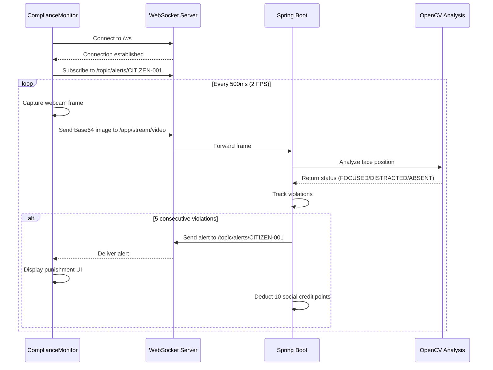

# 🔴 Surveillance System Integration Guide

## Overview

The `ComplianceMonitor` component provides real-time facial monitoring and behavioral analysis for the Tiering Machine system. It streams webcam footage to the backend via WebSockets and displays punishment alerts when violations are detected.

---

## Quick Start

### 1. Install Dependencies

```bash
npm install react-webcam @stomp/stompjs sockjs-client
```

### 2. Import and Use

```jsx
import ComplianceMonitor from './components/ComplianceMonitor';

function App() {
  const citizenId = 'CITIZEN-001'; // Get from auth context
  
  return (
    <div>
      <ComplianceMonitor citizenId={citizenId} />
      {/* Your other components */}
    </div>
  );
}
```

### 3. Start Backend

Ensure your Spring Boot backend is running at `http://localhost:8080`

---

## Component API

### Props

| Prop | Type | Required | Description |
|------|------|----------|-------------|
| `citizenId` | `string` | ✅ Yes | Unique citizen identifier (e.g., "CITIZEN-001") |

### Example

```jsx
<ComplianceMonitor citizenId="CITIZEN-001" />
```

---

## How It Works

### WebSocket Flow



### Behavioral States

| State | Detection | Meaning | Violation? |
|-------|-----------|---------|------------|
| **FOCUSED** | Frontal face detected | Citizen is working | ❌ No |
| **DISTRACTED** | Profile face detected | Citizen looking away | ✅ Yes |
| **ABSENT** | No face detected | Citizen abandoned post | ✅ Yes |

### Punishment Protocol

1. **Violation Detection**: Backend tracks consecutive DISTRACTED or ABSENT frames
2. **Threshold**: 5 consecutive violations (~2.5 seconds at 2 FPS)
3. **Punishment**:
   - Deduct **10 social credit points**
   - Send WebSocket alert: `"EYES ON THE SCREEN, CITIZEN."`
   - Display full-screen red warning
4. **Reset**: Counter gradually resets when citizen returns to FOCUSED state

---

## Backend Integration

### WebSocket Configuration

- **Endpoint**: `ws://localhost:8080/ws`
- **Protocol**: STOMP over SockJS
- **Alert Topic**: `/topic/alerts/{citizenNumber}`
- **Stream Destination**: `/app/stream/video`

### Message Format

#### Outgoing (Client → Server)

```javascript
// Frame data
{
  destination: '/app/stream/video',
  headers: {
    citizenNumber: 'CITIZEN-001'
  },
  body: 'base64EncodedImageString' // JPEG without data URI prefix
}
```

#### Incoming (Server → Client)

```json
{
  "message": "EYES ON THE SCREEN, CITIZEN.",
  "penaltyPoints": 10
}
```

---

## UI Features

### 1. Connection Status Indicator

- **Location**: Top-right corner
- **States**:
  - 🔴 **Connected**: Red badge with pulsing dot
  - ⚫ **Disconnected**: Gray badge
  - ⚠️ **Error**: Error state

### 2. Hidden Webcam

- **Visibility**: Completely hidden (opacity: 0, 1x1 pixel)
- **Purpose**: Capture frames without user seeing themselves
- **Resolution**: 640x480
- **Format**: JPEG

### 3. Punishment Alert Overlay

When violations occur:

- **Full-screen red flashing border** (animated pulse)
- **Large warning text** at top of viewport
- **Message**: Backend-provided alert (e.g., "EYES ON THE SCREEN, CITIZEN.")
- **Duration**: 5 seconds auto-dismiss
- **Style**: Intimidating red theme with drop shadows

---

## Advanced Usage

### Custom Alert Handling

```jsx
import { useEffect, useRef, useState } from 'react';
import ComplianceMonitor from './components/ComplianceMonitor';

function App() {
  const [violations, setViolations] = useState(0);
  const [totalPenalty, setTotalPenalty] = useState(0);

  // You can extend the component or listen to console logs
  // for custom violation tracking

  return (
    <div>
      <div className="stats">
        <p>Violations: {violations}</p>
        <p>Total Penalty: -{totalPenalty} points</p>
      </div>
      
      <ComplianceMonitor citizenId="CITIZEN-001" />
    </div>
  );
}
```

### Integration with Auth Context

```jsx
import { useAuth } from './contexts/AuthContext';
import ComplianceMonitor from './components/ComplianceMonitor';

function Dashboard() {
  const { user } = useAuth();

  return (
    <div>
      <h1>Welcome, {user.citizenNumber}</h1>
      
      {/* Automatically use authenticated user's ID */}
      <ComplianceMonitor citizenId={user.citizenNumber} />
    </div>
  );
}
```

---

## Troubleshooting

### Issue: "SURVEILLANCE DISCONNECTED"

**Causes**:
- Backend not running
- Wrong WebSocket URL
- CORS issues

**Solutions**:
```bash
# Verify backend is running
curl http://localhost:8080/actuator/health

# Check WebSocket endpoint
curl http://localhost:8080/ws
```

### Issue: No frames being sent

**Causes**:
- Webcam permission denied
- Browser doesn't support getUserMedia
- Component unmounted before connection

**Solutions**:
- Check browser console for permission errors
- Ensure HTTPS in production (HTTP is OK for localhost)
- Verify `citizenId` prop is provided

### Issue: Alerts not appearing

**Causes**:
- Wrong subscription topic
- JSON parsing error
- Backend not sending alerts

**Solutions**:
- Check console logs for "⚠️ ALERT RECEIVED"
- Verify backend is sending to `/topic/alerts/{citizenNumber}`
- Ensure alert format matches: `{ message: string, penaltyPoints: number }`

---

## Performance Considerations

### Frame Rate

- **Default**: 2 FPS (500ms interval)
- **Bandwidth**: ~50-100 KB/s per client
- **CPU**: Minimal impact on client side

### Memory Management

- **Cleanup**: Automatic on component unmount
- **Intervals**: Properly cleared to prevent leaks
- **WebSocket**: Auto-reconnect on disconnect

### Scalability

- **Backend**: Asynchronous processing (@Async)
- **OpenCV**: Native memory properly released
- **Concurrent Users**: Backend can monitor multiple citizens simultaneously

---

## Security Notes

> [!WARNING]
> This is a hackathon project demonstrating dystopian surveillance concepts. In production:
> - Implement proper authentication/authorization
> - Use HTTPS/WSS for encrypted communication
> - Add rate limiting to prevent abuse
> - Obtain explicit user consent for webcam access
> - Comply with privacy regulations (GDPR, etc.)

---

## Example Application

See [`src/examples/ComplianceMonitorExample.jsx`](./src/examples/ComplianceMonitorExample.jsx) for a complete example with:

- Control panel to start/stop monitoring
- System information display
- Behavioral state visualization
- Citizen ID input

---

## Testing

### Manual Testing

1. Start backend: `./gradlew bootRun`
2. Start frontend: `npm run dev`
3. Open browser and allow webcam access
4. Look at screen (frontal face) → Should be FOCUSED
5. Turn head to side (profile) → Should trigger violation after 5 frames
6. Look away completely → Should trigger violation after 5 frames
7. Verify alert appears and social score is deducted

### Browser Console

Monitor surveillance activity:
```javascript
// Connection status
🔴 SURVEILLANCE ACTIVE

// Alert received
⚠️ ALERT RECEIVED: { message: "EYES ON THE SCREEN, CITIZEN.", penaltyPoints: 10 }
Penalty: -10 points
```

---

## API Reference

### Backend Endpoints

| Endpoint | Type | Description |
|----------|------|-------------|
| `/ws` | WebSocket | STOMP connection endpoint |
| `/app/stream/video` | Message | Receive video frames |
| `/topic/alerts/{citizenNumber}` | Topic | Send alerts to specific citizen |

### Frontend Component

```typescript
interface ComplianceMonitorProps {
  citizenId: string; // Required: Unique citizen identifier
}

const ComplianceMonitor: React.FC<ComplianceMonitorProps>;
```

---

## Big Brother is Watching 👁️

The surveillance system is now fully operational. Citizens will be monitored continuously, and violations will be punished swiftly and automatically.

*"In the age of compliance, privacy is a privilege, not a right."*
